## 빠른 참조

Mermaid 다이어그램 전문가 v7.0.0 - MCP Playwright 통합을 통한 순수 스킬 기반 Mermaid 렌더링.

이 스킬은 21가지 다이어그램 유형에 대한 Mermaid 11.12.2 구문, SVG/PNG 출력 렌더링을 위한 MCP Playwright 통합, 바로 사용 가능한 예제와 참조 문서, 모범 사례가 적용된 엔터프라이즈 다이어그램 패턴을 제공함.

스킬 이름 do-library-mermaid를 사용하여 표준 스킬 호출 패턴으로 호출.

---

## 지원 다이어그램 유형

21가지 다이어그램 유형을 5개 카테고리로 구성:

### 구조 다이어그램

Flowchart는 프로세스 흐름과 의사 결정 트리에 사용. Sequence는 상호작용 시퀀스와 메시지 흐름에 사용. Class는 객체 지향 클래스 관계에 사용. ER은 엔티티-관계 데이터베이스에 사용. Block은 블록 다이어그램 구조에 사용. State는 상태 머신과 상태 기반 흐름에 사용.

### 타임라인 및 추적 다이어그램

Timeline은 시간순 이벤트와 마일스톤에 사용. Gantt는 프로젝트 일정과 타임라인에 사용. Gitgraph는 Git 워크플로우와 브랜칭 시각화에 사용.

### 아키텍처 및 설계 다이어그램

C4는 Context, Container, Component, Code 아키텍처 다이어그램에 사용. Architecture는 시스템 아키텍처 다이어그램에 사용. Requirement는 요구사항 및 추적성 문서에 사용.

### 데이터 시각화 다이어그램

Pie Chart는 원형 및 도넛 차트에 사용. XY Chart는 산점도 및 선 차트에 사용. Sankey는 비례 너비의 흐름 다이어그램에 사용. Radar는 다변수 비교 차트에 사용.

### 사용자 및 프로세스 다이어그램

Mindmap은 계층적 마인드 매핑에 사용. User Journey는 사용자 경험 흐름에 사용. Kanban은 보드 상태 시각화에 사용. Packet은 네트워크 패킷 구조에 사용.

---

## MCP Playwright 통합

이 스킬은 다이어그램 렌더링을 위해 MCP Playwright와 통합됨. 프로젝트 mcp.json 파일의 MCP 구성은 Playwright 서버를 활성화하며, anthropic-ai playwright-mcp 패키지와 함께 npx를 사용하도록 구성 가능.

다이어그램 렌더링을 위한 전제 조건:
- 프로젝트 MCP 설정에서 MCP Playwright 서버 구성 필요
- 시스템에 Node.js 설치 필요
- npx를 통해 Playwright 사용 가능 필요

---

## 다이어그램 구문 예제

### Flowchart

Flowchart 다이어그램은 flowchart 키워드 다음에 TD(위에서 아래) 또는 LR(왼쪽에서 오른쪽) 같은 방향 표시자를 사용. 노드는 모양을 위한 괄호로 정의하고, 연결은 선택적 레이블과 함께 화살표 구문 사용.

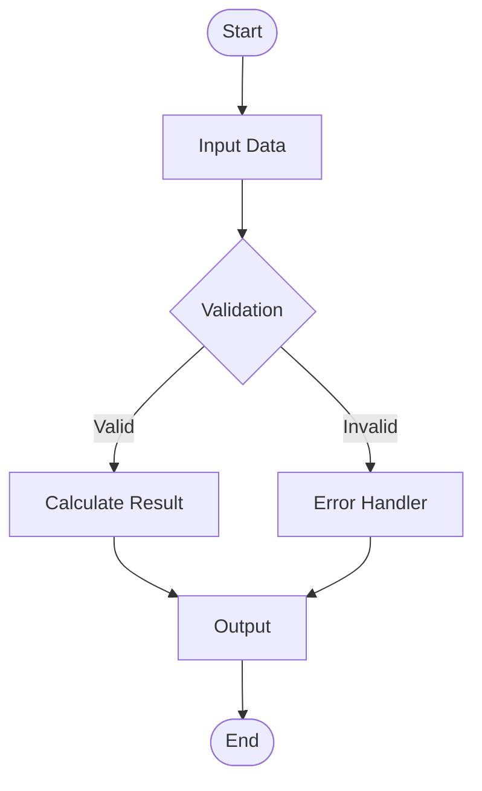

### Sequence

Sequence 다이어그램은 참가자를 먼저 정의한 후 화살표 표기법으로 상호작용을 표시. 실선 화살표는 동기 호출을, 점선 화살표는 응답을 나타냄.

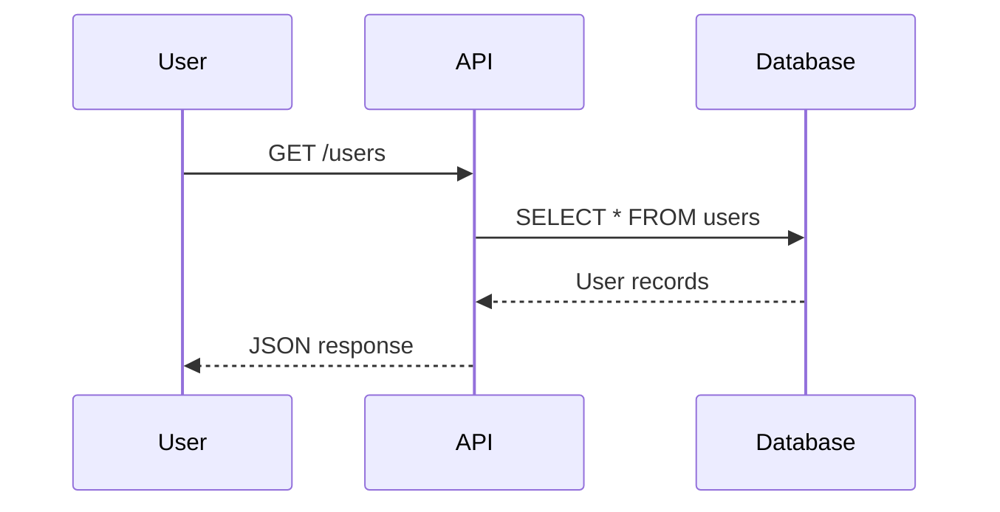

### Class

Class 다이어그램은 객체 지향 클래스와 관계를 정의. 속성과 메서드를 클래스 블록 내에 선언하고, 관계는 화살표 표기법으로 표시.

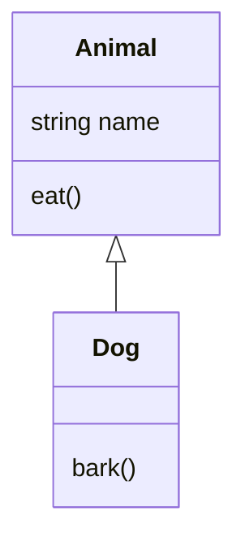

### State

State 다이어그램은 상태 머신과 상태 전이를 시각화. 시작과 종료 상태는 특수 표기법 사용.

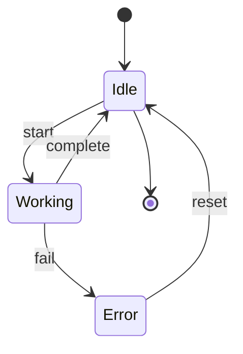

### ER

ER 다이어그램은 엔티티와 관계를 정의. 카디널리티 표기법으로 관계 유형을 명시.

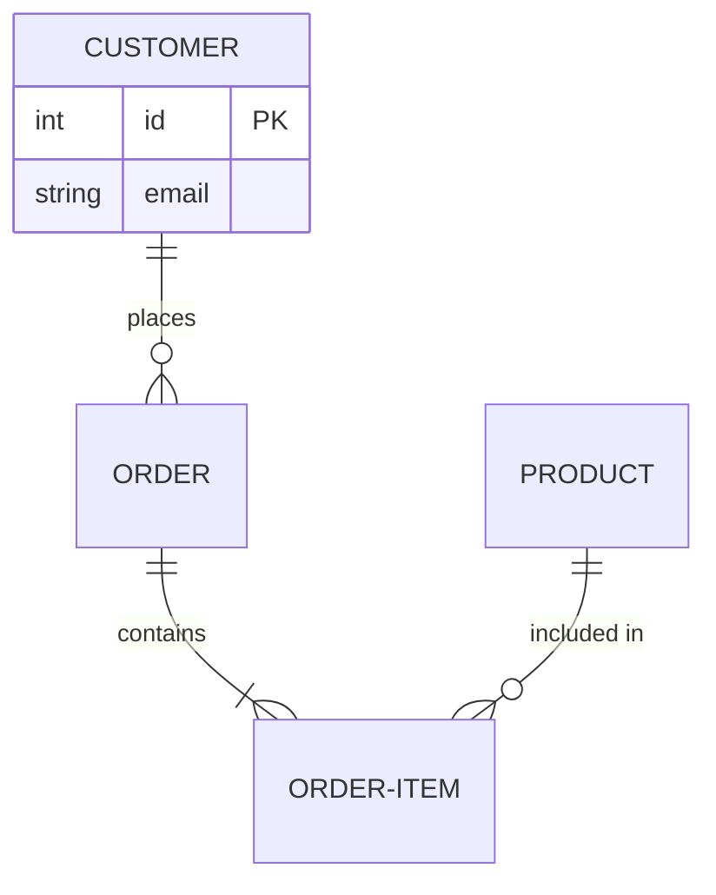

### Gantt

Gantt 차트는 프로젝트 일정과 작업 의존성을 시각화. 날짜 형식과 섹션으로 구성.

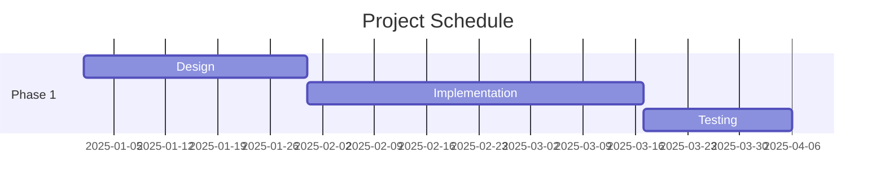

### Mindmap

Mindmap은 계층적 아이디어 구조를 시각화. 들여쓰기로 계층 표현.

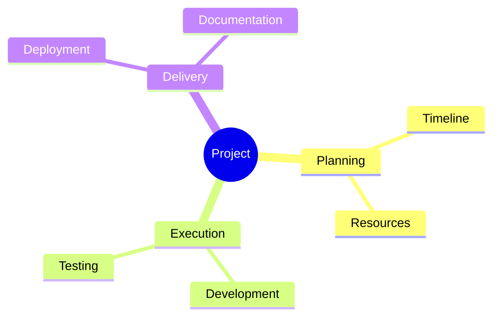

### Timeline

Timeline은 시간순 이벤트를 시각화. 날짜와 이벤트를 순서대로 나열.

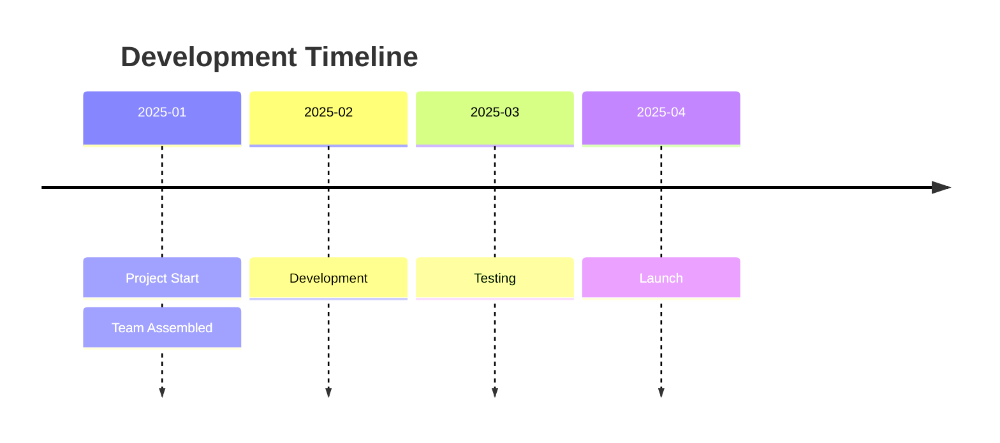

### Gitgraph

Gitgraph는 Git 브랜치와 커밋 히스토리를 시각화.

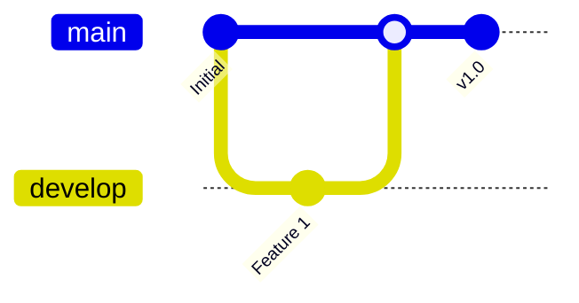

### C4 Context

C4 Context 다이어그램은 C4Context 키워드를 사용하고, 경계, 사람, 시스템, 관계를 각 요소 유형에 맞는 전용 함수로 정의.

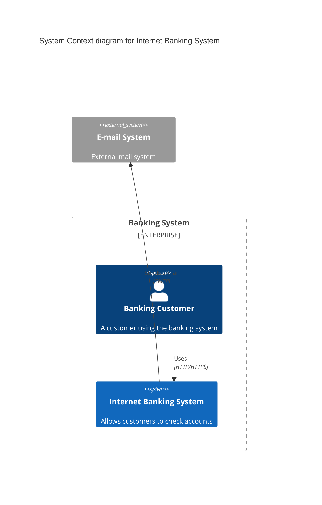

### User Journey

User Journey는 사용자 경험 흐름을 점수와 함께 시각화.

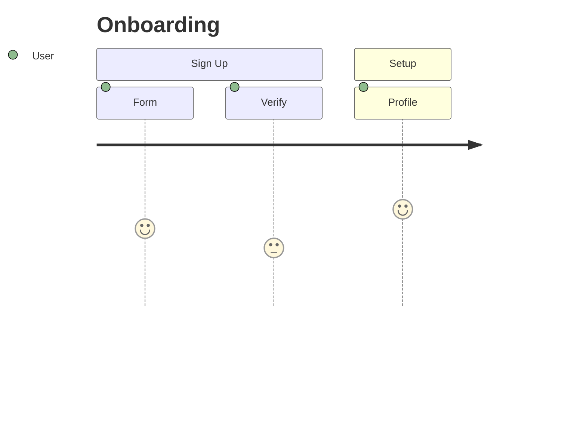

### Requirement

Requirement 다이어그램은 요구사항과 구성 요소 간 관계를 정의.

```mermaid
requirementDiagram
  requirement REQ1 {
    id: 1
    text: Authentication
    risk: High
  }
  element webapp {
    type: Software
  }
  REQ1 - satisfies - webapp
```

### Pie Chart

Pie Chart는 데이터 분포를 시각화.

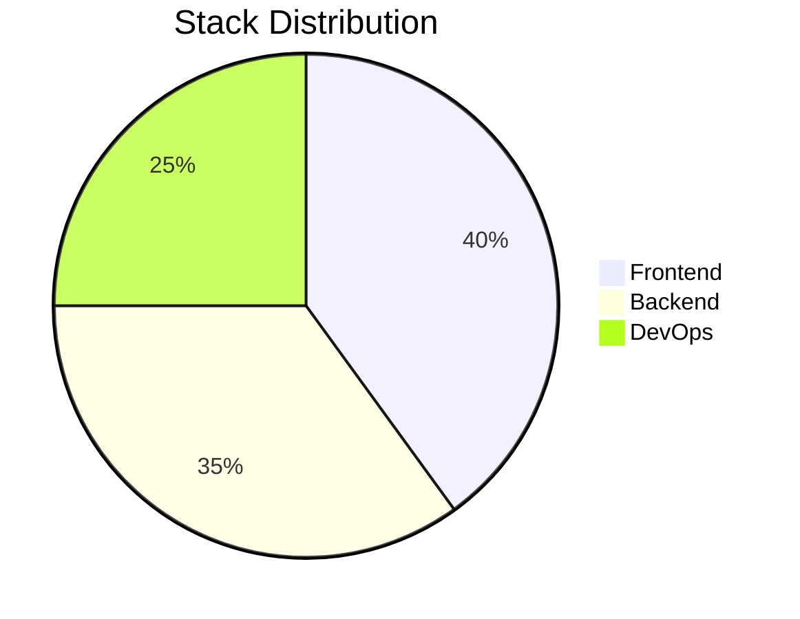

### XY Chart

XY Chart는 시계열 또는 비교 데이터를 시각화.

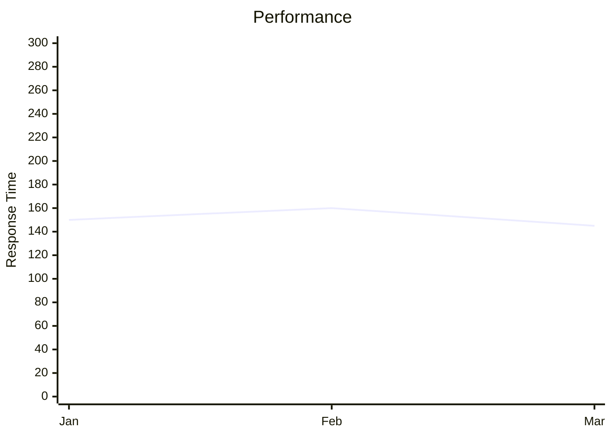

### Block

Block 다이어그램은 블록 구조와 흐름을 정의.

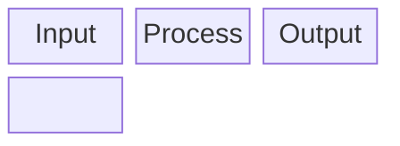

### Kanban

Kanban은 작업 상태를 보드 형태로 시각화.

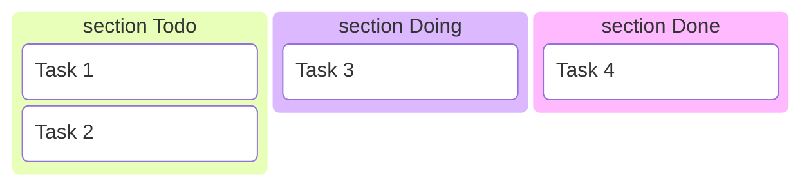

### Sankey

Sankey 다이어그램은 흐름과 비율을 시각화.

```mermaid
sankey-beta
  Users, 100
  Users, Development, 60
  Users, QA, 40
  Development, Production, 60
  QA, Production, 40
```

### Packet

Packet 다이어그램은 네트워크 프로토콜 구조를 시각화.


### Radar

Radar 차트는 다차원 데이터를 비교.

```mermaid
radar
  title Skills
  Frontend: 90
  Backend: 85
  DevOps: 75
  Design: 70
  max: 100
```

---

## 모범 사례

### 명확성과 가독성

모든 노드에 설명적 레이블 사용. 다이어그램 복잡도를 최대 20-30개 노드로 유지. 다이어그램 전체에 일관된 스타일과 색상 사용.

### 성능 고려사항

복잡한 다이어그램은 여러 개의 작은 다이어그램으로 분리. 서브그래프를 사용하여 대규모 플로우차트 구성. 렌더링 성능 유지를 위해 노드 내 텍스트 길이 제한.

### 접근성 요구사항

모든 다이어그램에 텍스트 대안 제공. 색상만 의존하지 않고 색상과 모양 차별화 함께 사용. 컨텍스트를 위한 설명적 제목과 범례 포함.

### 구성 관행

관련 다이어그램을 디렉토리에 그룹화. 다이어그램 파일에 일관된 명명 규칙 사용. 소스 파일 내 주석으로 다이어그램 목적 문서화.

---

## Do 워크플로우 통합

이 스킬은 다양한 개발 단계에서 Claude Code 내에서 사용하도록 설계됨:

do:1-plan 명령을 사용한 아키텍처 단계에서는 제안된 솔루션과 컴포넌트 관계를 시각화하기 위한 시스템 설계 다이어그램 생성.

do:3-sync 명령을 사용한 문서화 단계에서는 플로우차트, 시퀀스 다이어그램, 아키텍처 개요를 포함한 시각적 문서 생성.

코드 리뷰 단계에서는 시스템 설계를 시각적으로 전달하고 관심 영역 또는 제안된 변경사항을 강조하기 위해 다이어그램 사용.

온보딩 프로세스에서는 새로운 팀원이 아키텍처, 데이터 흐름, 시스템 경계를 이해하는 데 도움이 되는 다이어그램 생성.

---

## 일반 아키텍처 패턴

API 아키텍처 패턴은 C4 다이어그램으로 API 게이트웨이, 백엔드 서비스, 데이터베이스 관계를 표시. 마이크로서비스 흐름 패턴은 시퀀스 다이어그램으로 클라이언트 요청 흐름을 설명. 데이터 파이프라인 패턴은 플로우차트로 ETL 및 데이터 이동을 표시.

---

## 관련 스킬 및 명령

관련 스킬: do-docs-generation, do-library-nextra

활용 명령: do:1-plan(아키텍처 다이어그램), do:3-sync(시각적 문서화)

---

## 참고 자료

공식 사이트: mermaid.js.org / 라이브 에디터: mermaid.live / 구문 가이드: mermaid.js.org/syntax/

추가 문서: examples.md, reference.md, optimization.md, advanced-patterns.md

---

Version: 7.0.0
Last Updated: 2025-12-30
Mermaid Version: 11.12.2
